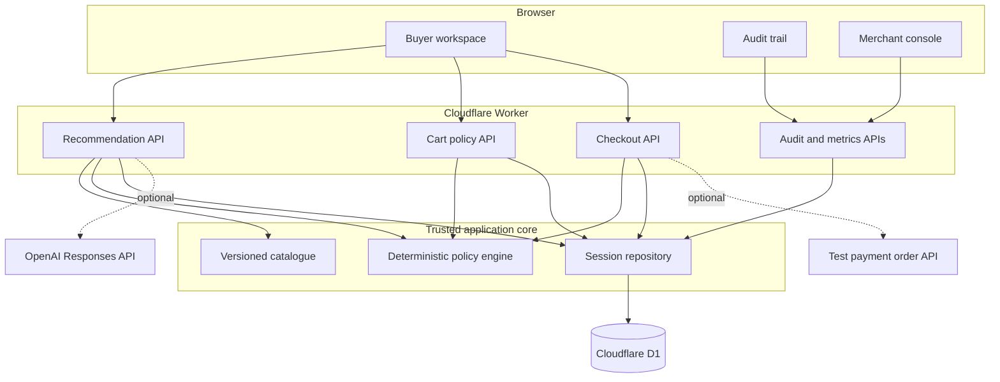
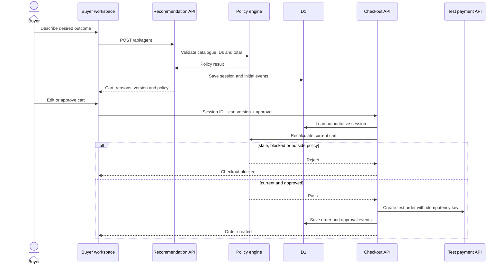
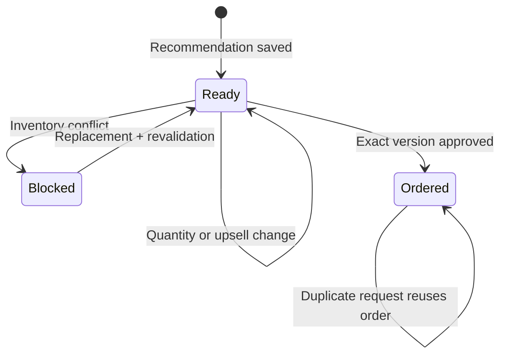
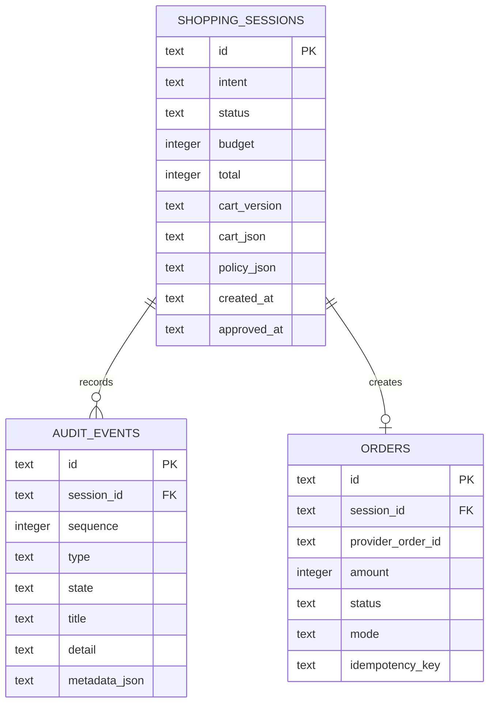

# IntentCart

IntentCart turns a shopping request into a cart that can explain itself.

Instead of opening ten product tabs, a buyer can write:

> Build a skincare gift for my sister under ₹2,000. She has sensitive skin, and I need it delivered by Friday.

IntentCart recommends a bundle from the merchant catalogue, explains each choice, checks the cart against the buyer's limits, and asks for approval of the exact cart version before creating a test order.

The important part is the boundary: the recommendation layer can suggest products, but it cannot authorize money. Catalogue validation, price calculation, inventory checks, cart versioning and approval all live in regular server code.

## Try it

| Surface | Purpose |
| --- | --- |
| [Product page](https://intent-cart.subhasree6289.chatgpt.site/) | The product story and core idea |
| [Buyer flow](https://intent-cart.subhasree6289.chatgpt.site/demo) | Build, edit, repair and approve a cart |
| [Merchant console](https://intent-cart.subhasree6289.chatgpt.site/merchant) | Revenue, conversion, policy state and recent sessions |
| [Audit trail](https://intent-cart.subhasree6289.chatgpt.site/audit) | The latest persisted decision trace |

Checkout runs in a test environment. The full order lifecycle is real application logic; no live payment is captured.

## What works today

- Natural-language shopping requests with schema validation.
- Model-backed recommendations when an OpenAI key is configured.
- A deterministic recommendation path when the model is unavailable.
- Catalogue-only product selection and server-calculated totals.
- A cart that is populated from the recommendation API response.
- Quantity changes and gift-wrap upsells revalidated on the server.
- Durable shopping sessions, audit events and orders in Cloudflare D1.
- Versioned carts that invalidate approval after every change.
- An inventory-conflict path that blocks checkout before order creation.
- Server-side repair using an in-stock replacement followed by fresh approval.
- Idempotent test-order creation.
- Merchant and audit pages generated from recorded session data.
- Downloadable JSON traces.

## System architecture



The model sits outside the trusted boundary. Its product IDs are checked against the catalogue and its proposed total is ignored. The server looks up current prices and computes the amount itself.

## Checkout lifecycle



The checkout request deliberately does not contain an amount. It contains only the session ID, current cart version and explicit approval. The server loads the cart from D1 and calculates the amount from catalogue prices.

## Inventory failure and recovery



The inventory-conflict control in the buyer workspace exercises the same server path a real inventory notification would call. It marks the session blocked, records that no money action was attempted, replaces the unavailable serum, increments the cart version and requires approval again.

## Data model



`(session_id, sequence)`, `orders.session_id` and `orders.idempotency_key` are unique. Recent-session and status queries have dedicated indexes. Schema changes are generated with Drizzle and shipped as append-only migrations.

## Policy boundary

Every cart is checked for:

1. known catalogue product IDs;
2. integer quantities between 1 and 3;
3. current stock;
4. delivery within the promised window;
5. a total within the buyer's ₹2,000 budget; and
6. an exact cart version at checkout.

The policy result is stored with the session and recalculated before order creation. A `passed` value from the client or model is never trusted.

## API surface

### `POST /api/agent`

Creates and persists a shopping session.

```json
{
  "intent": "Build a skincare gift under ₹2,000 for sensitive skin."
}
```

The response contains a session ID, cart version, normalized products, server total, policy result, fit score and recommendation mode.

### `POST /api/cart`

Updates the current cart or runs an inventory transition.

```json
{
  "sessionId": "IC-41F7A2B9",
  "cartVersion": "IC-41F7A2B9-v1",
  "action": "update",
  "items": [
    { "productId": "sku_cleanser_01", "quantity": 2 }
  ]
}
```

Supported actions are `update`, `conflict` and `repair`. Every successful update returns a new authoritative version when the cart changes.

### `POST /api/checkout`

```json
{
  "sessionId": "IC-41F7A2B9",
  "cartVersion": "IC-41F7A2B9-vm1abc23",
  "approval": true
}
```

The server rejects missing approval, stale versions, blocked sessions, changed totals and failed policy checks. A repeated request for an already completed version returns the existing order.

### `GET /api/audit?sessionId=...`

Returns the session and its ordered event list. Without a session ID it returns the latest recorded trace.

### `GET /api/merchant`

Returns aggregate revenue, order value, conversion counts, blocked-session counts and recent sessions from D1.

## Running locally

You need Node.js 22.13 or newer and npm.

```bash
git clone https://github.com/6289subhasree/intent-cart.git
cd intent-cart
npm ci
cp .env.example .env.local
npm run dev
```

Open the local URL printed by Vite.

`npm run dev` applies unapplied D1 migrations to the local database before starting the app. No API credentials are required for the full persisted cart, policy, failure, repair and test-order flow.

Typical setup time:

- first run: roughly 2–5 minutes, mostly dependency installation;
- later runs: usually under a minute;
- full build and test suite: usually under a minute on a modern laptop.

### Optional recommendation model

```env
OPENAI_API_KEY=your_key_here
OPENAI_MODEL=gpt-5-mini
```

Without these values, IntentCart uses its deterministic recommendation path. Persistence, policy enforcement and checkout behavior are unchanged.

### Optional test payment provider

```env
PAYMENT_ORDER_API_URL=https://your-provider.example/orders
PAYMENT_KEY_ID=your_test_key
PAYMENT_KEY_SECRET=your_test_secret
PAYMENT_IDEMPOTENCY_HEADER=X-Idempotency-Key
```

The adapter sends HTTP Basic authentication, an amount in paise and the cart-derived idempotency key. Keep credentials in `.env.local`; that file is ignored by Git.

## Commands

| Command | Purpose |
| --- | --- |
| `npm run dev` | Apply local migrations and start the app |
| `npm run db:local` | Apply only the local D1 migrations |
| `npm run db:generate` | Generate a migration after a schema change |
| `npm run build` | Produce the Worker-compatible build |
| `npm test` | Build and run the full test suite |
| `npm run evaluate` | Recalculate the controlled evaluation fixture |

## Tests

The suite covers the complete session lifecycle, not only isolated helpers:

- recommendation creates a saved session with a server-priced cart;
- audit events can be read back in order;
- checkout requires explicit approval;
- checkout rejects an older cart version;
- over-budget quantity changes produce a blocked session;
- inventory failure prevents order creation;
- repair replaces the unavailable product and resets approval;
- a valid approval creates an order;
- a repeated checkout reuses that order;
- merchant totals reflect the stored order;
- catalogue price calculation and invalid-item handling; and
- production Worker rendering and shared UI semantics.

The API lifecycle tests use the same SQLite migration as production against an in-memory database, so schema mistakes and query errors fail the suite.

## Repository map

```text
app/
├── api/
│   ├── agent/route.ts       recommendation + session creation
│   ├── cart/route.ts        cart edits, conflicts and repair
│   ├── checkout/route.ts    approval, policy reload and order creation
│   ├── audit/route.ts       persisted trace reader
│   └── merchant/route.ts    aggregate session metrics
├── demo/page.tsx            buyer workspace
├── audit/page.tsx           trace viewer
├── merchant/page.tsx        merchant console
└── page.tsx                 product page
db/
├── schema.ts                Drizzle schema
└── repository.ts            prepared D1 queries
drizzle/                     append-only SQL migrations
lib/commerce.ts              catalogue, totals, policy and repair
tests/                       lifecycle, policy, rendering and UI tests
worker/index.ts              Cloudflare Worker entry point
```

## Evaluation fixture

`evaluation/summary.json` is a controlled 500-session benchmark that can be reproduced with `npm run evaluate`. It is kept separate from the merchant console: the console now displays recorded application sessions, while the fixture remains useful for repeatable regression comparisons.

## Technology

- React 19 and TypeScript
- Vinext and Vite
- Cloudflare Workers and D1
- Drizzle migrations with prepared D1 statements
- Zod request validation
- Tailwind CSS and Shadcn UI primitives
- Recharts
- OpenAI Responses API as an optional recommendation provider

## Next useful additions

- Merchant-managed catalogue ingestion instead of the bundled five-product catalogue.
- Webhook-driven inventory updates.
- Authentication and merchant-level data isolation.
- Expiring approval tokens for long-running carts.
- Provider webhook reconciliation for order status.
- Observability around model latency, fallback rate and policy rejection reasons.

Those are deliberately separate from the current core: the repository already demonstrates the full recommendation → policy → persisted session → approval → test order → audit loop end to end.
