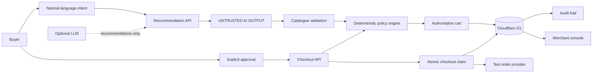

# IntentCart

> **Bounded agentic commerce:** turn a natural-language shopping request into an explainable, buyer-approved cart without giving the model control over money.

[Live demo](https://intent-cart.subhasree6289.chatgpt.site/) · [Buyer flow](https://intent-cart.subhasree6289.chatgpt.site/demo) · [Merchant console](https://intent-cart.subhasree6289.chatgpt.site/merchant)

---

## The idea

A buyer should be able to say:

> “Build a skincare gift for my sister under ₹2,000. She has sensitive skin, and I need it by Friday.”

IntentCart turns that request into a real application workflow:

**Intent → Recommendation → Validation → Policy → Approval → Checkout → Audit**

The key design decision is simple:

> **The AI can recommend. The server decides.**

The model never gets to authorize a payment, invent a product, set the final price, or bypass the buyer's constraints. Product IDs are validated against the merchant catalogue, prices are calculated server-side, inventory is checked again at checkout, and the buyer must approve the exact cart version.

---

## Why this project is interesting

Most AI shopping demos stop at “the model recommended these products.”

IntentCart treats the recommendation as **untrusted input** and connects it to a stateful commerce system.

That means the interesting engineering problems are not only AI:

- What happens when the model suggests an invalid product?
- What if the buyer changes the quantity after recommendation?
- What if the catalogue changes before checkout?
- What if two checkout requests race each other?
- What if the payment provider times out after stock has been reserved?
- What if the provider succeeds but saving the order fails?
- How do you recover without accidentally creating a duplicate order?

IntentCart has explicit server-side paths for these cases.

---

## Try the workflow

### 1. Describe the outcome

Open the [buyer flow](https://intent-cart.subhasree6289.chatgpt.site/demo) and try:

`Only sunscreen. No cleanser, serum or gift wrap. Budget ₹600.`

The system should select the ₹599 sunscreen rather than ignoring the exclusions or inventing a bundle.

### 2. Inspect the decision

The response shows:

- selected catalogue products
- reasons for the recommendation
- server-calculated total
- policy checks
- cart version
- recommendation mode

### 3. Change the cart

Edit the quantity and watch the server revalidate the cart.

Approval is tied to the **exact cart version**, so changing the cart invalidates the previous approval.

### 4. Approve and checkout

The checkout request contains only:

`sessionId + cartVersion + approval`

It does **not** contain a trusted amount.

The server reloads the authoritative session, recalculates the total and runs the policy again before creating a test order.

### 5. Inspect the audit trail

Open the [audit trail](https://intent-cart.subhasree6289.chatgpt.site/audit) to see the persisted sequence of decisions.

The [merchant console](https://intent-cart.subhasree6289.chatgpt.site/merchant) also provides catalogue management, order recovery and store-scoped metrics.

> **Demo note:** checkout uses test orders. No live customer payment is captured.

---

## Architecture



### Trusted boundary

The recommendation model sits outside the trusted commerce boundary.

The server:

1. validates every product ID against the current catalogue;
2. ignores any model-proposed total;
3. calculates the total from catalogue prices;
4. checks quantity, stock, delivery and budget constraints;
5. persists the authoritative cart;
6. requires explicit buyer approval;
7. compares the submitted cart version atomically; and
8. recalculates the policy immediately before checkout.

This makes the model useful without making it authoritative.

---

## Checkout reliability

Checkout is deliberately treated as a distributed-systems problem rather than a single API call.

### Versioned carts

Every cart has a version.

If a stale browser submits an older version, the server rejects the write instead of silently overwriting newer state.

### Atomic checkout claim

Before contacting the order provider, the server atomically changes the session from ready to approved and reserves inventory.

This prevents concurrent checkout requests from creating multiple provider orders for the same session.

### Idempotency

The checkout uses a deterministic idempotency key derived from the saved cart version and total.

A repeated request for an already completed checkout returns the saved order instead of creating another one.

### Uncertain provider outcomes

If the provider times out, returns an invalid response, or the local order save fails after provider success, the session remains locked for review.

The system does **not** blindly retry.

A reconciliation workflow can verify a terminal provider outcome before releasing a reservation or recording a recovered order.

The repository includes controlled tests for:

- concurrent checkout requests
- stale cart updates
- inventory races
- provider timeouts
- provider amount mismatches
- failed database persistence after provider success
- duplicate recovery requests
- late checkout completion
- transaction races

See [checkout concurrency tests](tests/checkout-concurrency.test.mjs) and [order recovery tests](tests/order-recovery.test.mjs).

---

## Policy engine

Every cart is checked server-side for:

| Constraint | Enforcement |
| --- | --- |
| Product identity | Must exist in the current catalogue |
| Quantity | Integer quantity from 1–3 |
| Budget | Server-calculated total must be within the parsed budget |
| Inventory | Current stock must cover the requested quantity |
| Delivery | Catalogue estimate must satisfy the requested window |
| Approval | Buyer must approve the current cart |
| Cart version | Checkout must use the current authoritative version |

Both model recommendations and deterministic fallback recommendations pass through the same validation path.

Example:

`Only sunscreen under ₹100`

returns a **no-match** response rather than silently relaxing the request.

---

## Inventory conflicts

Inventory can change between recommendation and checkout.

IntentCart can mark a saved product unavailable for that session, persist that exclusion and attempt a replacement that still satisfies the request.

If no valid replacement exists, the cart remains blocked instead of silently substituting a product.

Reservations are retained when a provider outcome is uncertain. Stock is released only after a terminal non-creation outcome has been established.

See the [order recovery API](app/api/orders/reconcile/route.ts) and [commerce policy code](lib/commerce.ts).

---

## Security and ownership

IntentCart includes a private merchant workspace rather than a public shared dashboard.

Each merchant owns a store, and the server resolves the store from the authenticated session rather than trusting a store ID supplied by the browser.

Implemented protections include:

- PBKDF2-HMAC-SHA256 password hashing with random salts
- hashed random session tokens
- HttpOnly, SameSite cookies
- Secure cookies over HTTPS
- seven-day session expiry
- origin checks for state-changing requests
- request-size limits
- database-backed login and reset rate limits
- store-scoped session, order and audit queries
- catalogue-version checks during checkout
- server-side request validation with Zod

This is application-level security work, not a claim of production security certification.

---

## Merchant workspace

Each account gets its own store and editable catalogue.

From the merchant console you can:

- edit product names, prices, stock and delivery estimates
- create custom categories and tags
- import CSV/JSON catalogues
- export the current catalogue
- inspect shopping sessions
- inspect orders and uncertain checkouts
- run recovery for supported test/external provider flows
- view store-scoped metrics

Catalogue prices are entered in rupees and stored as integer paise.

---

## API surface

| Endpoint | Purpose |
| --- | --- |
| `POST /api/agent` | Create a shopping session from buyer intent |
| `POST /api/cart` | Update, conflict or repair a cart |
| `POST /api/checkout` | Validate approval and create/reuse an order |
| `GET /api/audit` | Read the persisted decision trace |
| `GET /api/merchant` | Read store-scoped metrics |
| `GET /api/catalogue` | Read the authenticated store catalogue |
| `PUT /api/catalogue` | Versioned catalogue update |

The checkout API intentionally accepts no client-supplied amount.

---

## Testing

The test suite exercises the application as a stateful system, including:

- recommendation and session creation
- server-side price calculation
- policy validation
- stale cart rejection
- approval requirements
- inventory conflicts
- replacement and repair
- idempotent checkout
- merchant isolation
- authentication and recovery
- concurrent cart writes
- concurrent checkout
- uncertain provider outcomes
- recovery races
- Worker rendering and shared UI behavior

Tests use an in-memory SQLite/D1-compatible setup for API lifecycle coverage and controlled provider responses for checkout failure scenarios.

Run everything with:

`npm test`

---

## Run locally

### Requirements

- Node.js **22.13+**
- npm

### Setup

```bash
git clone https://github.com/6289subhasree/intent-cart.git
cd intent-cart
npm ci
cp .env.example .env.local
npm run dev
```

Open the local URL printed by Vite.

No API key is required for the deterministic recommendation path or the persisted cart/policy/test-order workflow.

### Optional AI provider

The recommendation layer can use an LLM when configured:

```env
OPENAI_API_KEY=your_key_here
OPENAI_MODEL=gpt-5-mini
```

If the model is unavailable or produces an invalid selection, IntentCart falls back to its constrained deterministic recommendation path.

### Optional test order provider

```env
PAYMENT_ORDER_API_URL=https://your-provider.example/orders
PAYMENT_KEY_ID=your_test_key
PAYMENT_KEY_SECRET=your_test_secret
PAYMENT_IDEMPOTENCY_HEADER=X-Idempotency-Key
```

Keep credentials in `.env.local`.

---

## Commands

| Command | Purpose |
| --- | --- |
| `npm run dev` | Apply local migrations and start the app |
| `npm run db:local` | Apply local D1 migrations |
| `npm run db:generate` | Generate a Drizzle migration |
| `npm run typecheck` | Type-check the Worker and application |
| `npm run build` | Build the Worker-compatible application |
| `npm test` | Build and run the test suite |
| `npm run evaluate` | Recalculate the controlled evaluation fixture |

---

## Repository structure

```text
app/
├── api/
│   ├── agent/route.ts
│   ├── cart/route.ts
│   ├── checkout/route.ts
│   ├── audit/route.ts
│   └── merchant/route.ts
├── demo/page.tsx
├── audit/page.tsx
├── merchant/page.tsx
└── page.tsx

db/
├── schema.ts
└── repository.ts

lib/
├── commerce.ts
└── ...

drizzle/                  SQL migrations
tests/                    Lifecycle, reliability and UI tests
worker/                   Cloudflare Worker entry point
evaluation/               Controlled regression fixture
```

---

## Technology

- **React 19 + TypeScript**
- **Vinext + Vite**
- **Cloudflare Workers + D1**
- **Drizzle ORM**
- **Zod**
- **Tailwind CSS**
- **Recharts**
- **OpenAI Responses API** as an optional recommendation provider

---

## Current scope

IntentCart is a working prototype of bounded agentic commerce, not a production ecommerce platform.

Not yet included:

- public shopper accounts
- staff roles and permissions
- MFA
- email-based account recovery
- ecommerce-platform inventory synchronization
- authenticated inventory webhooks
- provider webhooks for asynchronous order status
- production payment capture
- unrestricted natural-language constraint extraction

These are intentionally separate from the core demonstration: **AI recommendation → deterministic validation → persisted cart → explicit approval → reliable checkout → audit trail.**

---

## Evaluation

The repository contains a controlled evaluation fixture under `evaluation/` for repeatable regression comparisons.

It should not be interpreted as:

- customer traction
- measured conversion uplift
- production A/B results
- evidence of live payment volume

Checkout in the demo creates test orders only.

---

## License

Private project repository.
