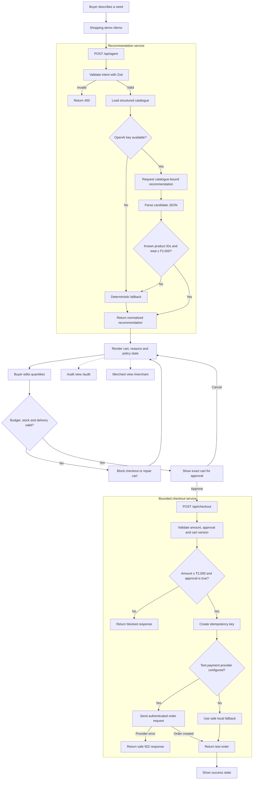

# IntentCart

IntentCart is an agentic shopping application that turns a plain-language request into a cart the buyer can understand, edit and approve.

I built it around a simple question: instead of making someone search for products one by one, can a shopping interface start with the outcome they want?

For example:

> Build a skincare gift for my sister under ₹2,000. She has sensitive skin, and I need it delivered by Friday.

IntentCart reads a structured catalogue, recommends a bundle, explains why each item was selected and checks the cart against the buyer's limits. It cannot complete checkout until the buyer approves the exact amount.

## Live demo

| Page | What it shows |
| --- | --- |
| [Landing page](https://intent-cart.subhasree6289.chatgpt.site/) | Product overview and the main idea |
| [Shopping demo](https://intent-cart.subhasree6289.chatgpt.site/demo) | Intent input, recommendations, cart controls and checkout |
| [Merchant dashboard](https://intent-cart.subhasree6289.chatgpt.site/merchant) | Example conversion, order-value and policy metrics |
| [Audit trail](https://intent-cart.subhasree6289.chatgpt.site/audit) | A readable trace of one complete shopping session |

The public demo uses test checkout, so it never charges real money.

## What the system does

- Accepts a natural-language shopping request.
- Selects only products that exist in the supplied catalogue.
- Recomputes the total on the server instead of trusting a model-generated total.
- Rejects recommendations above the ₹2,000 demo budget.
- Explains why products were selected and why an alternative was rejected.
- Lets the buyer change quantities before approval.
- Blocks checkout when stock changes or the cart exceeds the budget.
- Requires explicit approval of the current cart and amount.
- Creates an idempotency key from the cart version and approved amount.
- Falls back to a deterministic recommendation when an AI key is missing or the model response is unusable.

## Architecture

The model is used for recommendation, not authorization. Every decision that can allow or block checkout is handled by normal application code.



### Why the flow is split this way

The recommendation route is allowed to suggest products, but its output is treated as untrusted. The server checks every product ID against the catalogue and calculates the total again before returning the result.

The checkout route has a separate validation boundary. It accepts only:

- a positive integer amount in paise;
- an amount no greater than ₹2,000;
- an explicit `approval: true`; and
- a non-empty cart version.

This means a model response by itself can never create an order.

## Request lifecycle

1. The buyer writes a request in the shopping interface.
2. `POST /api/agent` validates that the intent is between 8 and 500 characters.
3. The route sends the request and catalogue to the configured model, if a key is available.
4. The returned product IDs are checked against the local catalogue.
5. Prices are looked up from the catalogue and the total is recalculated server-side.
6. Invalid output, an unavailable provider or a budget violation triggers the deterministic fallback.
7. The buyer reviews the cart, changes quantities if needed and sees the remaining budget.
8. Checkout stays disabled if the budget or inventory checks fail.
9. After explicit approval, `POST /api/checkout` validates the amount and cart version again.
10. The server sends an authenticated request to the configured test payment provider. When no provider is configured, it uses the safe local fallback so the flow remains usable.

## Failure handling

The demo includes a **Simulate inventory conflict** action. It makes the selected serum unavailable immediately before checkout.

When that happens:

1. checkout is paused;
2. the interface explains which constraint failed;
3. the unavailable item is replaced with an in-stock alternative;
4. the budget and delivery promise are checked again; and
5. the buyer has to review the repaired cart before continuing.

The current inventory conflict is triggered in the browser. The same stop, repair and re-approval sequence can later be connected to live inventory events.

## API reference

### `POST /api/agent`

Request:

```json
{
  "intent": "Build a skincare gift under ₹2,000 for sensitive skin."
}
```

Important response fields:

```json
{
  "cart": ["sku_cleanser_01", "sku_serum_04", "sku_spf_07"],
  "total": 189700,
  "currency": "INR",
  "fitScore": 0.96,
  "reasons": {
    "sku_cleanser_01": "Fragrance-free and suited to sensitive skin"
  },
  "policy": {
    "withinBudget": true,
    "stockValid": true,
    "deliveryValid": true,
    "approvalRequired": true
  },
  "mode": "ai"
}
```

`mode` is `deterministic_fallback` when the AI provider is not configured or its response fails validation.

### `POST /api/checkout`

Request:

```json
{
  "amount": 189700,
  "approval": true,
  "cartVersion": "IC-2048"
}
```

The amount is expressed in paise. A valid request creates a test order through the configured payment adapter:

```json
{
  "id": "order_demo_abc123",
  "amount": 189700,
  "currency": "INR",
  "status": "created",
  "mode": "payment_provider_test",
  "idempotencyKey": "intentcart-IC-2048-189700"
}
```

## Frontend surfaces

### Landing page

Introduces the intent-first shopping model and links to the working demo, merchant view and audit trail.

### Shopping demo

Contains the main interactive flow: intent input, recommendation mode, product reasoning, quantity controls, budget progress, inventory failure handling and an approval dialog.

The interface keeps cart and inventory state in the browser while the server routes handle recommendation validation and checkout authorization.

### Merchant dashboard

Shows how an intent-led flow can be evaluated from a merchant's side: conversion, average order value, order mix and policy compliance. The displayed values come from the included evaluation fixture.

### Audit trail

Shows the sequence of recommendation, policy, approval, failure and order events for a complete shopping session.

## Project structure

```text
app/
├── api/
│   ├── agent/route.ts       # recommendation, catalogue checks and fallback
│   └── checkout/route.ts    # approval and amount validation
├── audit/page.tsx           # readable decision trace
├── demo/page.tsx            # interactive buyer experience
├── merchant/page.tsx        # merchant metrics
├── page.tsx                 # landing page
└── globals.css
components/ui/               # reusable interface primitives
evaluation/summary.json      # reproducible evaluation result
scripts/evaluate.mjs         # verifies the evaluation fixture
tests/                       # guardrail, rendering and UI tests
worker/index.ts              # Cloudflare Worker entry point
```

## Running locally

Requirements:

- Node.js 22.13 or newer
- npm

```bash
git clone https://github.com/6289subhasree/intent-cart.git
cd intent-cart
npm ci
cp .env.example .env.local
npm run dev
```

The app works without external credentials. To enable the model-backed recommendation path, add:

```env
OPENAI_API_KEY=your_key_here
OPENAI_MODEL=gpt-5-mini
```

To connect a test payment provider, add its order endpoint and test credentials:

```env
PAYMENT_ORDER_API_URL=https://your-provider.example/orders
PAYMENT_KEY_ID=your_test_key
PAYMENT_KEY_SECRET=your_test_secret
PAYMENT_IDEMPOTENCY_HEADER=X-Idempotency-Key
```

The checkout adapter uses HTTP Basic authentication, sends the amount in paise and attaches the generated idempotency key. Keep these values in `.env.local` and never commit the file.

## Commands

| Command | Purpose |
| --- | --- |
| `npm run dev` | Start the local development server |
| `npm run build` | Create the Worker-compatible production build |
| `npm test` | Build the app and run all automated tests |
| `npm run evaluate` | Validate and print the evaluation fixture |

## Tests

The current suite checks:

- checkout requests above the approved budget are rejected;
- checkout cannot proceed without explicit approval;
- the main landing page renders from the production Worker;
- shared UI components preserve required semantics; and
- generated CSS contains the utilities used by the interface.

## Evaluation

The repository includes a deterministic evaluation fixture representing 500 shopping sessions.

| Metric | Catalogue baseline | IntentCart |
| --- | ---: | ---: |
| Converted sessions | 195 / 500 | 243 / 500 |
| Conversion rate | 39.0% | 48.6% |
| Average order value | ₹1,646 | ₹1,946 |
| Injected failures handled | — | 25 / 25 |
| Blocked policy actions executed | — | 0 |

The calculated lift is 24.62% for converted sessions and 18.23% for average order value.

These are controlled evaluation results rather than live customer analytics. The fixture is included so every value can be reproduced and checked.

## Technology

- React 19 and TypeScript
- Vinext and Vite
- Zod for request validation
- Tailwind CSS and Shadcn UI primitives
- Recharts for merchant visualizations
- OpenAI Responses API for optional recommendations
- Cloudflare Workers-compatible server output

## Current scope

- The catalogue currently contains four skincare products.
- The buyer interface is optimized around the included gift-shopping use case.
- Inventory events and audit records are not persisted between sessions yet.
- Authentication, persistent carts and a live inventory connector are the next backend additions.
