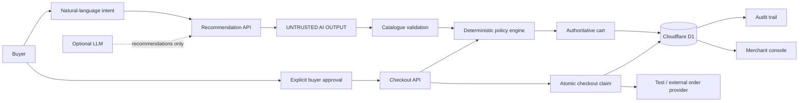
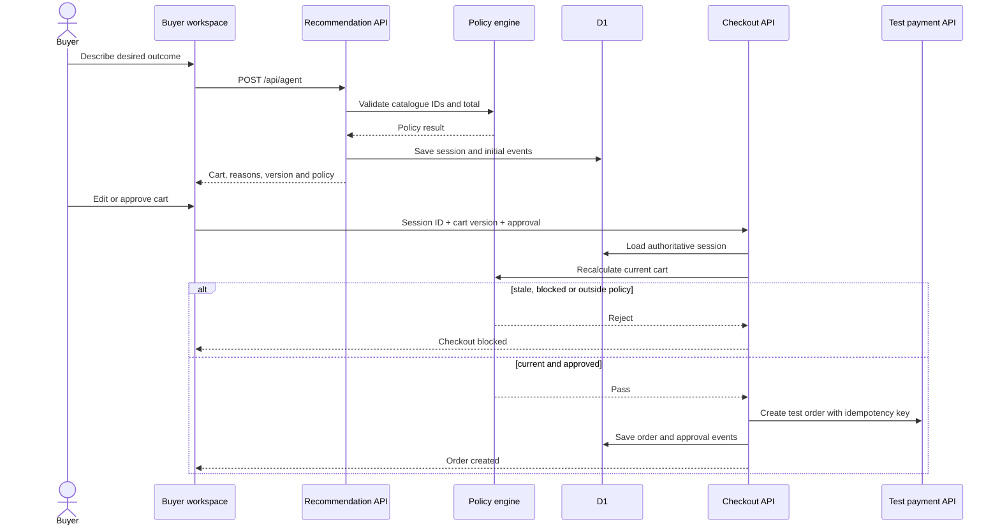
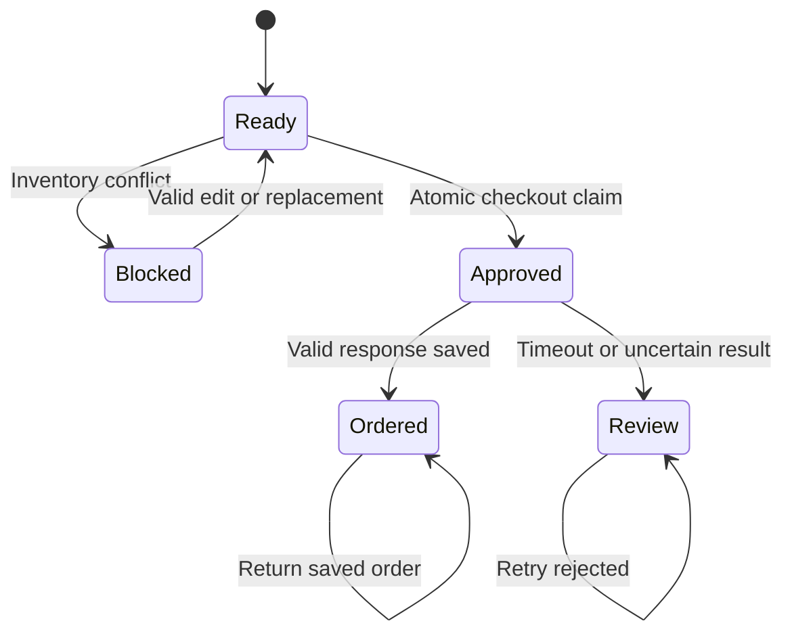
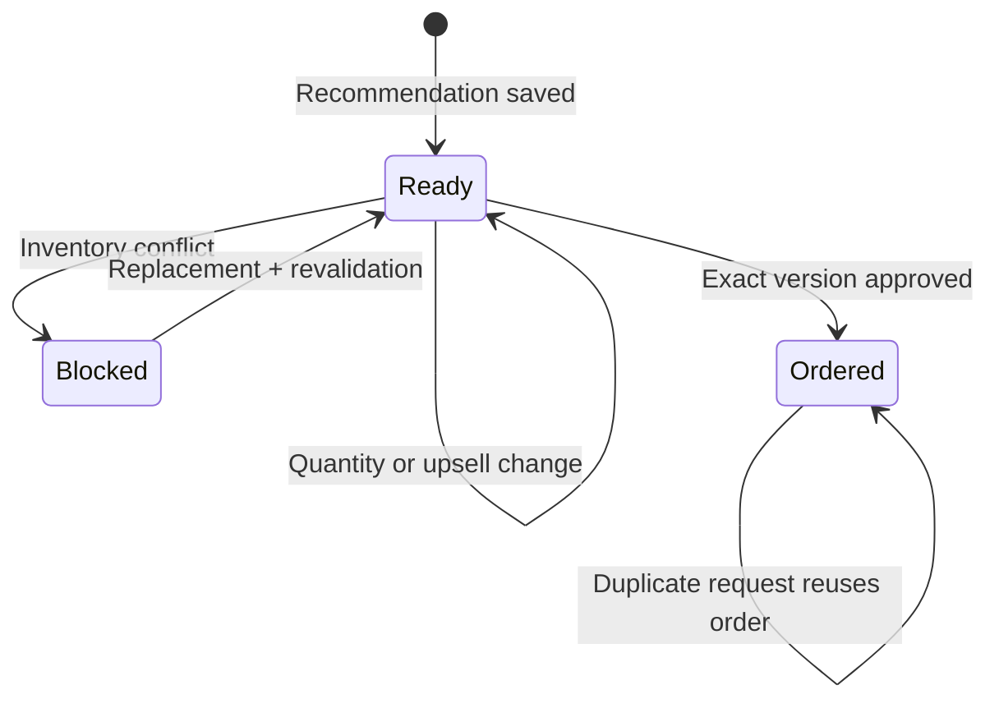
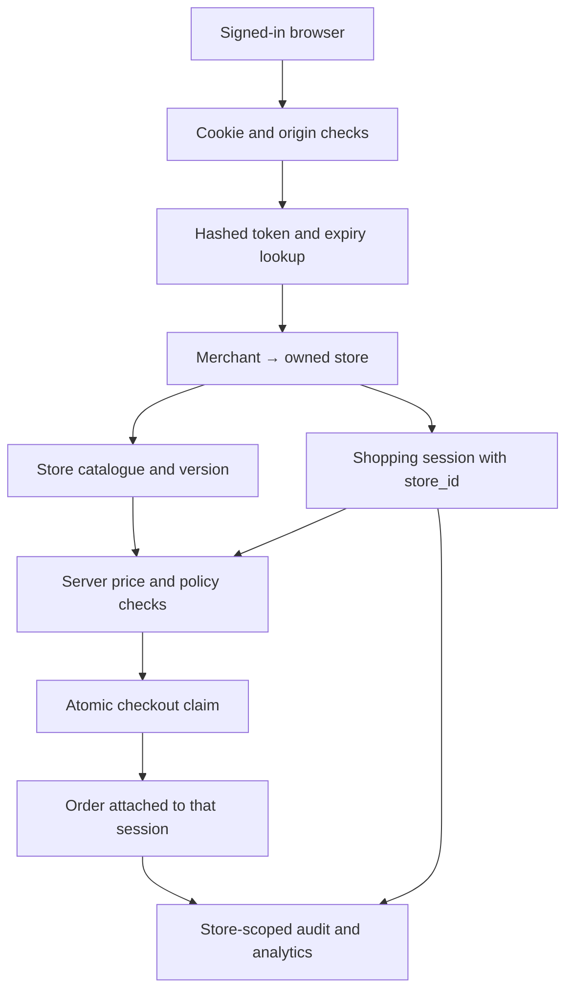
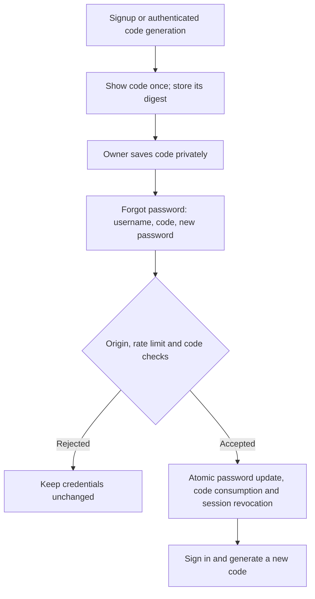
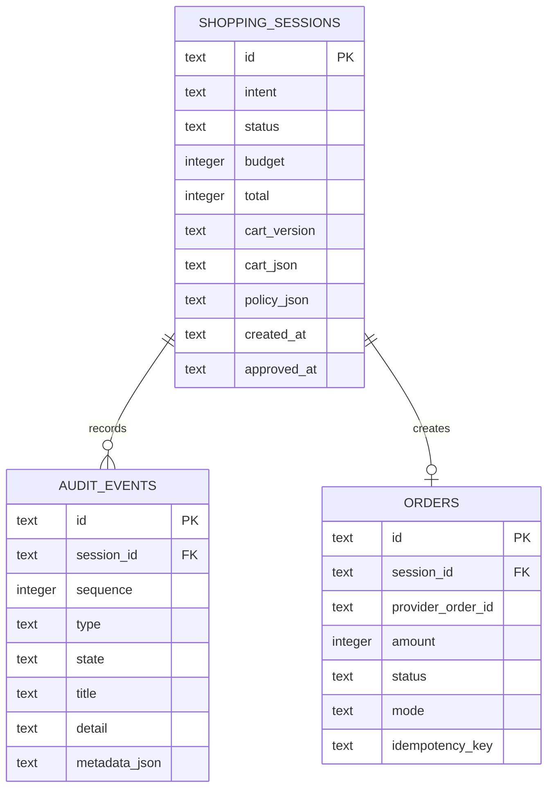

# IntentCart

> **Bounded agentic commerce:** turn a natural-language shopping request into an explainable, buyer-approved cart without giving the model control over money.

IntentCart explores one central architecture question:

> **How do you let an AI participate in a transaction without letting the AI control the transaction?**

The answer is a strict separation between **recommendation** and **commerce authority**.

**Intent → Recommendation → Catalogue Validation → Deterministic Policy → Authoritative Cart → Buyer Approval → Checkout → Audit**

The core invariant is:

> **The AI can recommend. The server decides.**

---

## 1. System architecture



The architecture has two fundamentally different zones.

### Untrusted / model-influenced zone

The recommendation layer may use an LLM to interpret buyer intent and suggest catalogue products.

Its output is never trusted as commerce state.

The model cannot:

- create products
- invent product IDs
- choose the authoritative price
- authorize checkout
- override stock
- bypass budget or delivery constraints
- modify the persisted cart directly

### Trusted commerce boundary

Everything that can affect the transaction is controlled by server-side application logic.

The trusted boundary owns:

- catalogue identity
- prices
- inventory
- policy evaluation
- cart state
- cart versions
- buyer approval
- checkout claims
- idempotency
- order persistence
- recovery
- audit events
- merchant/store ownership

This boundary is the main architectural idea behind the project.

---

## 2. Buyer intent

The buyer starts with an outcome rather than a structured product query.

Example:

> “Build a skincare gift for my sister under ₹2,000. She has sensitive skin, and I need it by Friday.”

The recommendation API converts this intent into a structured candidate selection.

Natural language is an input to the system, not a source of authority.

The resulting session stores the buyer's constraints so that later cart and checkout operations can be evaluated against the same request.

---

## 3. Recommendation layer

The recommendation layer can operate in two modes:

1. **Optional LLM recommendation**
2. **Deterministic constrained fallback**

The LLM is useful for interpreting intent and selecting plausible catalogue products, but both paths converge on the same server-side validation pipeline.

```text
Buyer intent
    ↓
Recommendation
    ↓
Untrusted product selection
    ↓
Catalogue validation
    ↓
Policy evaluation
    ↓
Authoritative cart
```

This means the fallback path is not a second, weaker commerce implementation. It is another way of producing input for the same trusted boundary.

If the model is unavailable or produces an invalid selection, the system can continue through the deterministic path rather than allowing malformed AI output to become application state.

---

## 4. Catalogue validation

The catalogue is the source of truth for product identity and price.

A recommendation can contain product identifiers, but the server verifies every identifier against the current merchant catalogue before accepting it.

This prevents a model from effectively creating a product by returning an arbitrary identifier.

Catalogue validation establishes the values later used by the policy engine:

- product identity
- category
- price
- stock
- delivery estimate
- supported metadata

The client and model therefore do not get to define the commercial meaning of a product.

---

## 5. Deterministic policy engine

After catalogue validation, the proposed cart passes through a deterministic policy engine.

| Constraint | Server-side rule |
| --- | --- |
| Product identity | Product must exist in the current catalogue |
| Quantity | Integer quantity from 1–3 |
| Budget | Total is calculated from catalogue prices |
| Inventory | Current stock must cover requested quantity |
| Delivery | Catalogue estimate must satisfy the requested window |
| Approval | Checkout requires approval of the current cart |
| Cart version | Checkout must target the current authoritative version |

The important property is **determinism**.

The model may suggest a cart, but it does not decide whether that cart is valid.

For example, if a buyer asks for:

**Only sunscreen under ₹100**

and no valid catalogue product satisfies the request, the correct outcome is a **no-match** result rather than silently relaxing the constraint.

---

## 6. Authoritative cart

Once a candidate selection passes validation and policy evaluation, the server creates the authoritative cart.

The cart is persisted rather than being treated as a client-side object.

The browser is therefore not a trusted source of:

- price
- total
- product availability
- policy state
- approval state
- checkout state

The persisted cart becomes the source of truth for the remainder of the workflow.

A useful mental model is:

```text
Recommendation = proposal
Cart = server-owned state
Checkout = transition of server-owned state
```

---

## 7. Cart versioning

Every cart state has a version.

When a buyer edits the cart, the server creates a new authoritative version and re-evaluates the resulting state.

Approval is tied to a specific version.

```text
Cart v7
  ↓
Buyer approves v7
  ↓
Buyer edits cart
  ↓
Cart v8
  ↓
Approval for v7 is no longer sufficient
```

This prevents a stale approval from authorizing a different cart.

It also protects against stale browser tabs and concurrent edits overwriting newer state.

The server compares the expected version against the authoritative version rather than trusting a browser's view of the cart.

---

## 8. Explicit buyer approval

The recommendation process and the purchase authorization process are separate.

The buyer must explicitly approve the exact cart version before checkout.

The checkout request contains the session identity, cart version and approval context—not a client-supplied trusted amount.

The server then reloads authoritative state and performs its own checks.

This creates a clear boundary:

**AI recommendation → buyer review → buyer approval → server-authorized checkout**

---

## 9. Checkout architecture

Checkout is intentionally implemented as a state transition rather than a simple payment API call.

At checkout, the server:

1. authenticates the session;
2. verifies that the session and cart belong to the correct merchant/store;
3. verifies the approved cart version;
4. reloads authoritative cart state;
5. re-evaluates commerce policy;
6. recalculates the total from catalogue data;
7. atomically claims checkout;
8. reserves the required inventory;
9. contacts the test or external order provider;
10. validates the provider response;
11. persists the terminal order state; and
12. records the relevant audit events.

The same policy is therefore evaluated at the point where the transaction matters—not only when the recommendation was generated.



---

## 10. Atomic checkout claim

Concurrent checkout requests are a core race condition.

Without an atomic claim, two requests could observe the same ready session and both attempt to create an order.

IntentCart uses a server-side atomic state transition before contacting the provider.

```text
READY
  ↓ atomic claim
CHECKOUT_IN_PROGRESS
  ↓
provider operation
  ↓
ORDERED / REVIEW_REQUIRED
```

Only the request that successfully claims the session proceeds as the active checkout attempt.

The database state is therefore part of the concurrency control rather than relying on the browser to serialize requests.



---

## 11. Idempotency

Distributed systems can produce the uncomfortable situation where the client does not know whether an operation succeeded.

For example:

```text
IntentCart → provider
             ↓
          order created
             ↓
       response is lost
             ↓
IntentCart sees a timeout
```

Blindly retrying could create a duplicate order.

IntentCart therefore derives an idempotency key from authoritative checkout state and uses the persisted checkout/order state when handling repeated requests.

A repeated request for an already completed checkout can return the existing order instead of creating another one.

---

## 12. Provider response validation

A successful HTTP response is not automatically treated as a valid order result.

The application validates the provider response against the checkout it intended to create.

This includes checking the expected commercial amount and the provider's returned order information.

The server therefore does not simply trust an external provider response because it returned a success status.

---

## 13. Uncertain outcomes and reconciliation

The hardest checkout case is an **uncertain outcome**.

Examples include:

- provider timeout
- malformed provider response
- provider succeeds but local order persistence fails
- network failure after the provider has accepted the order

In these situations the system does not blindly retry.

Instead, the session can enter a review/reconciliation state.

The principle is:

> **When the system cannot prove that an external operation did not happen, preserve enough state to investigate before releasing or retrying.**

Reservations are retained while the provider outcome remains uncertain.

A reconciliation workflow can establish a terminal provider outcome before the application releases inventory or records a recovered order.

---

## 14. Inventory conflicts and repair

Inventory can change after recommendation but before checkout.

IntentCart treats this as a normal state transition rather than an exceptional UI error.

If a saved product becomes unavailable, the system can:

1. persist the unavailable product for that session;
2. prevent checkout with the invalid state;
3. search for a constrained replacement;
4. re-run validation and policy;
5. update the authoritative cart if a valid replacement exists; or
6. keep the cart blocked if no valid replacement satisfies the original constraints.

The system does not silently substitute a product merely to complete the transaction.

This preserves the buyer's original constraints across recovery.



---

## 15. Audit trail

Important decisions are persisted as audit events.

The audit layer provides a trace through the stateful workflow:

```text
intent
  → recommendation
  → validation
  → policy result
  → cart update
  → approval
  → checkout claim
  → provider outcome
  → order / recovery state
```

This makes the system explainable after the fact.

The audit trail is also useful for debugging race conditions and recovery flows because the application can inspect the sequence of persisted state transitions rather than relying only on client logs.

---

## 16. Merchant isolation

IntentCart contains a merchant workspace with store-scoped data.

The browser does not get to choose which merchant's data it can access simply by supplying a store ID.

The server resolves the store from the authenticated session and scopes queries accordingly.

The same ownership boundary applies to:

- catalogues
- shopping sessions
- orders
- audit events
- merchant metrics

Tenant isolation is therefore a server-side authorization rule rather than a frontend convention.



---

## 17. Security boundary

Authentication and request validation are implemented as infrastructure around the trusted commerce layer.

Current protections include:

- PBKDF2-HMAC-SHA256 password hashing with random salts
- hashed random session tokens
- HttpOnly and SameSite cookies
- Secure cookies over HTTPS
- seven-day session expiry
- origin checks for state-changing requests
- request-size limits
- database-backed login and reset rate limits
- store-scoped authorization
- server-side request validation with Zod
- catalogue-version checks during checkout

These controls protect the application boundary, but they are not presented as a production security certification.



---

## 18. API architecture

The API layer is intentionally thin around the domain and persistence layers.

### Recommendation

**POST /api/agent**

Creates a shopping session from buyer intent and returns the recommendation plus the resulting server-owned session state.

### Cart

**POST /api/cart**

Handles cart updates, inventory conflicts and supported repair operations.

### Checkout

**POST /api/checkout**

Accepts the session/cart approval context, reloads authoritative state and performs the checkout state transition.

It intentionally does **not** accept a trusted client-supplied amount.

### Audit

**GET /api/audit**

Returns the persisted decision trace for the authenticated context.

### Catalogue

**GET /api/catalogue**

Reads the authenticated merchant's catalogue.

**PUT /api/catalogue**

Updates catalogue state with versioning.

### Merchant

**GET /api/merchant**

Returns store-scoped merchant metrics and operational information.

---

## 19. Persistence model

Cloudflare D1 provides durable application state, with Drizzle ORM providing typed database access.



The database stores the state required to make the workflow recoverable:

- merchant/store identity
- catalogue and catalogue version
- shopping sessions
- cart state and versions
- approvals
- inventory/reservation state
- orders
- recovery information
- audit events
- authentication/session data
- rate-limit state

The important architectural property is that critical state lives on the server and can be reloaded during later requests.

---

## 20. Failure handling as architecture

Failure handling is not an afterthought in IntentCart.

| Failure | Architectural response |
| --- | --- |
| Invalid AI product | Reject at catalogue validation |
| Model unavailable | Use constrained deterministic recommendation |
| No product satisfies constraints | Return no-match rather than relaxing silently |
| Stale cart | Reject stale write |
| Cart changed after approval | Require approval of new version |
| Inventory changed | Block or run constrained repair |
| Concurrent checkout | Atomic checkout claim |
| Duplicate retry | Idempotent checkout state |
| Provider timeout | Enter uncertain/review state |
| Provider amount mismatch | Reject invalid outcome |
| Provider success + local persistence failure | Reconcile instead of blind retry |
| Merchant/store mismatch | Server-side ownership check |

The architecture is designed around preserving invariants under failure, not only around the happy path.

---

## 21. Testing strategy

The test suite treats the application as a stateful system.

Coverage includes:

- recommendation and session creation
- server-side price calculation
- policy validation
- stale cart rejection
- approval requirements
- inventory conflicts
- replacement and repair
- idempotent checkout
- merchant isolation
- authentication and recovery
- concurrent cart writes
- concurrent checkout
- uncertain provider outcomes
- recovery races
- transaction ordering
- Worker rendering and shared UI behavior

The checkout and recovery tests use controlled provider behavior to exercise failure scenarios that are difficult to reproduce reliably against a real external service.

Key test files:

- tests/checkout-concurrency.test.mjs
- tests/order-recovery.test.mjs

---

## 22. Repository structure

```text
app/
├── api/
│   ├── agent/route.ts
│   ├── cart/route.ts
│   ├── checkout/route.ts
│   ├── audit/route.ts
│   └── merchant/route.ts
├── demo/page.tsx
├── audit/page.tsx
├── merchant/page.tsx
└── page.tsx

db/
├── schema.ts
└── repository.ts

lib/
├── commerce.ts
└── ...

drizzle/                  SQL migrations
tests/                    Lifecycle, reliability and UI tests
worker/                   Cloudflare Worker entry point
evaluation/               Controlled regression fixture
```

The main application flow is:

```text
app/api
   ↓
domain + policy
   ↓
db/repository
   ↓
Cloudflare D1

app/demo
app/merchant
app/audit
   ↓
same server-owned APIs
```

The UI does not implement a second version of the commerce rules.

---

## 23. Technology

- **React 19 + TypeScript** — application and UI
- **Vinext + Vite** — application/build layer
- **Cloudflare Workers + D1** — runtime and persistence
- **Drizzle ORM** — typed database access
- **Zod** — request/schema validation
- **Tailwind CSS** — UI styling
- **Recharts** — merchant analytics
- **OpenAI Responses API** — optional recommendation provider

---

## 24. Local development

### Requirements

- Node.js **22.13+**
- npm

### Setup

```bash
git clone https://github.com/6289subhasree/intent-cart.git
cd intent-cart
npm ci
cp .env.example .env.local
npm run dev
```

The deterministic recommendation path and persisted cart/policy/test-order workflow do not require an AI API key.

An optional LLM can be configured through environment variables:

```env
OPENAI_API_KEY=your_key_here
OPENAI_MODEL=gpt-5-mini
```

An optional test/external order provider can also be configured through environment variables.

---

## 25. Development commands

| Command | Purpose |
| --- | --- |
| npm run dev | Apply local migrations and start the app |
| npm run db:local | Apply local D1 migrations |
| npm run db:generate | Generate a Drizzle migration |
| npm run typecheck | Type-check the Worker and application |
| npm run build | Build the Worker-compatible application |
| npm test | Build and run the test suite |
| npm run evaluate | Recalculate the controlled evaluation fixture |

---

## 26. Current scope

IntentCart is a working prototype of bounded agentic commerce rather than a complete production ecommerce platform.

The core architecture currently demonstrates:

**AI recommendation → deterministic validation → persisted cart → explicit approval → reliable checkout → recovery → audit**

Features such as public shopper accounts, staff roles, MFA, production payment capture, ecommerce-platform inventory synchronization and asynchronous provider webhooks remain outside the current scope.

The separation is intentional: the project focuses on demonstrating how an AI recommendation layer can be connected to commerce infrastructure without allowing the model to become the authority over the transaction.

---

## License

Private project repository.
