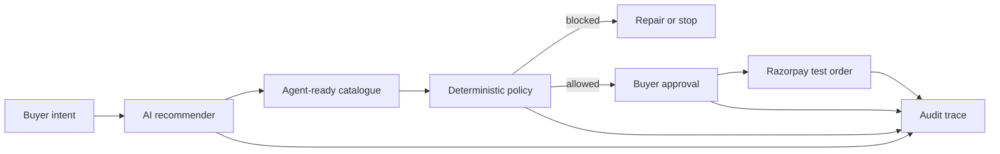

# IntentCart

**From shopping intent to approved checkout.**

IntentCart is a bounded AI shopping agent built for **Track 01 — AI Growth & Agentic Commerce** of the Razorpay AI Buildathon. A buyer describes an outcome, budget, preferences and delivery constraint; IntentCart reads an agent-ready merchant catalogue, composes a suitable cart, explains every choice, runs deterministic policy checks, requests explicit approval and creates a Razorpay test order.

## Live product

- [Landing page](https://intent-cart.subhasree6289.chatgpt.site/)
- [Buyer experience](https://intent-cart.subhasree6289.chatgpt.site/demo)
- [Merchant analytics](https://intent-cart.subhasree6289.chatgpt.site/merchant)
- [Complete decision trace](https://intent-cart.subhasree6289.chatgpt.site/audit)

## Why it exists

Search-led storefronts make buyers translate an outcome into keywords and manually compare dozens of products. They are also difficult for autonomous buyers to transact with safely. IntentCart exposes a structured catalogue and converts a buyer's intent into a bounded commerce workflow.

## What works

- Natural-language buyer intent input
- Server-side AI recommendation adapter with deterministic fallback
- Agent-readable catalogue and catalogue-only product selection
- Product-level recommendation reasons
- Live budget and quantity constraints
- Merchant-controlled, buyer-approved upsell
- Explicit approval of the exact cart and amount
- Razorpay Orders API adapter in test mode
- Safe local test fallback when API credentials are absent
- Idempotency key on order creation
- Inventory-conflict simulation
- Automatic cart repair and approval invalidation after a cart change
- Full event-by-event audit trace
- Merchant revenue, conversion, AOV and policy metrics
- Responsive landing, buyer, merchant and audit surfaces

## Architecture



The LLM is not an executor. It may recommend products and explain the fit, but only the deterministic policy layer can allow an action to proceed. A payment requires an approval scoped to the exact cart version and amount.

## Safety contract

Every money action is:

1. **Explainable** — selected and rejected products include reasons.
2. **Bounded** — budget, catalogue, inventory, quantity and delivery checks are deterministic.
3. **Gated** — the buyer approves the exact amount after the final cart validation.
4. **Idempotent** — the checkout adapter derives an idempotency key from cart version and amount.
5. **Audited** — recommendations, policy decisions, failures, repairs, approvals and payment results are traced.

### Graceful failure demonstrated

The buyer demo includes a deliberate inventory conflict. IntentCart blocks checkout before any money action, replaces the unavailable item, revalidates every bound and invalidates the old approval. The buyer must approve the repaired cart again.

## API routes

### `POST /api/agent`

Accepts:

```json
{ "intent": "Build a sensitive-skin gift under ₹2,000 and deliver it by Friday." }
```

Returns a catalogue-bound recommendation, reasons, rejected alternatives, fit score, total and policy results. If the configured AI provider is unavailable, the route degrades to a deterministic recommendation without weakening any guardrail.

### `POST /api/checkout`

Accepts:

```json
{ "amount": 189700, "approval": true, "cartVersion": "IC-2048-r1" }
```

The amount is in paise and cannot exceed ₹2,000 in this demo. With Razorpay credentials, the server creates a test order. Without credentials, it returns an explicitly labelled safe test order so the demo remains reproducible.

## Local setup

Requirements: Node.js 22.13 or newer.

```bash
npm ci
cp .env.example .env.local
npm run dev
```

Add test credentials to `.env.local`:

```env
OPENAI_API_KEY=
OPENAI_MODEL=gpt-5-mini
RAZORPAY_KEY_ID=
RAZORPAY_KEY_SECRET=
```

Never commit `.env.local` or a Razorpay secret. Use Razorpay test-mode keys only for this prototype.

## Verification

```bash
npm test
npm run evaluate
```

The evaluation fixture contains 500 deterministic synthetic shopping sessions and compares IntentCart with a catalogue-browsing baseline. It reports conversion lift, average-order-value lift, policy violations and handled failures. These are controlled simulation results, not production claims.

## Evaluation snapshot

| Metric | Baseline | IntentCart | Lift |
| --- | ---: | ---: | ---: |
| Converted sessions | 195 / 500 | 243 / 500 | +24.62% |
| Average order value | ₹1,646 | ₹1,946 | +18.23% |
| Policy violations executed | 0 | 0 | — |
| Injected failures handled | — | 25 / 25 | 100% |

## Stack

- Next.js-compatible Vinext and React
- TypeScript and Zod
- Tailwind CSS and Shadcn primitives
- Recharts
- OpenAI Responses API adapter
- Razorpay Orders API adapter
- Cloudflare Workers-compatible server routes

## Limitations

- The included catalogue and evaluation population are synthetic.
- The hosted demo uses safe fallback mode until API keys are configured.
- The prototype creates test orders; it does not capture real money.
- Authentication, live inventory connectors and production fulfilment are outside the Buildathon prototype scope.

## Submission status

- [x] Public GitHub repository
- [x] Hosted working product
- [x] Architecture and safety contract
- [x] Synthetic evaluation and reproducible tests
- [ ] Five-minute unlisted pitch video
- [ ] Final application responses and submission

## Official references

- [Razorpay AI Buildathon](https://razorpay.com/buildathon/)
- [Razorpay API reference](https://razorpay.com/docs/api/)
- [Razorpay Webhooks](https://razorpay.com/docs/webhooks)
- [Razorpay Standard Checkout](https://razorpay.com/docs/developer-tools/integrations/standard-checkout)
