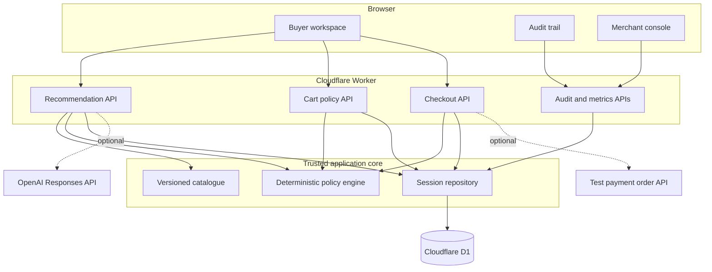
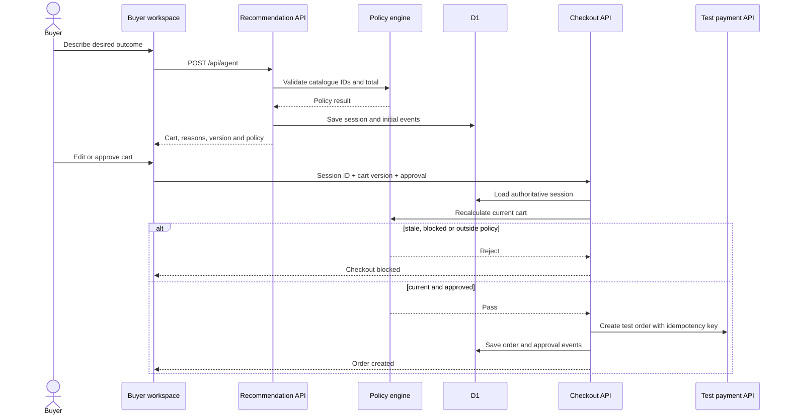
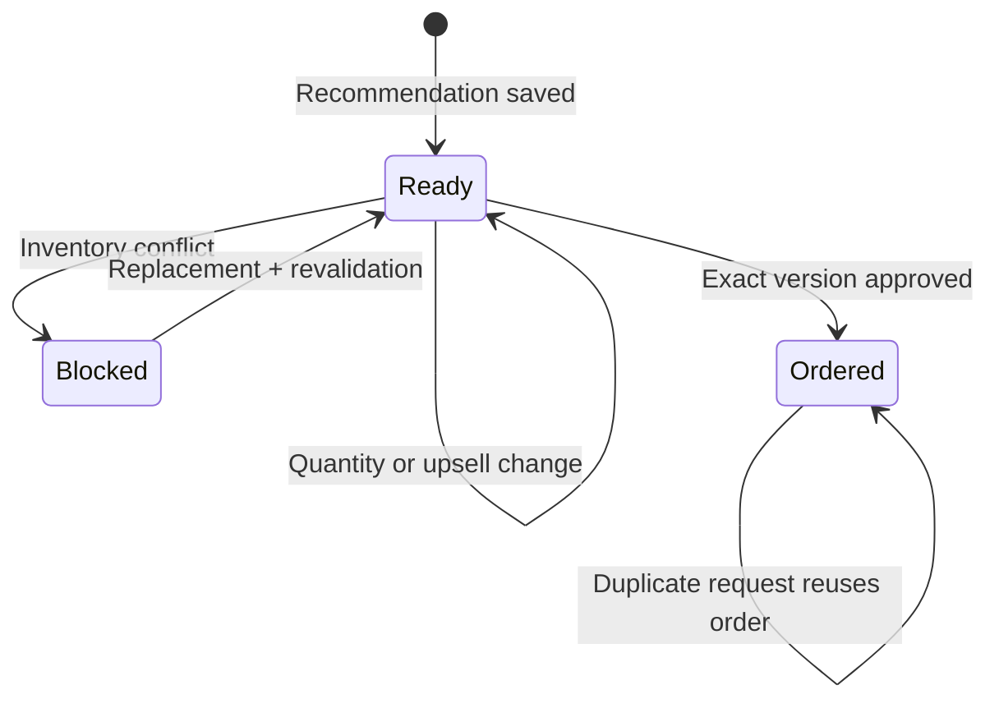
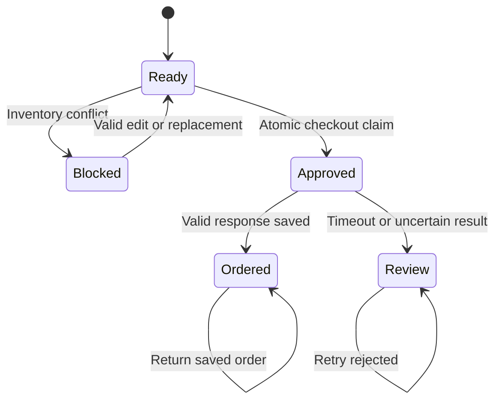
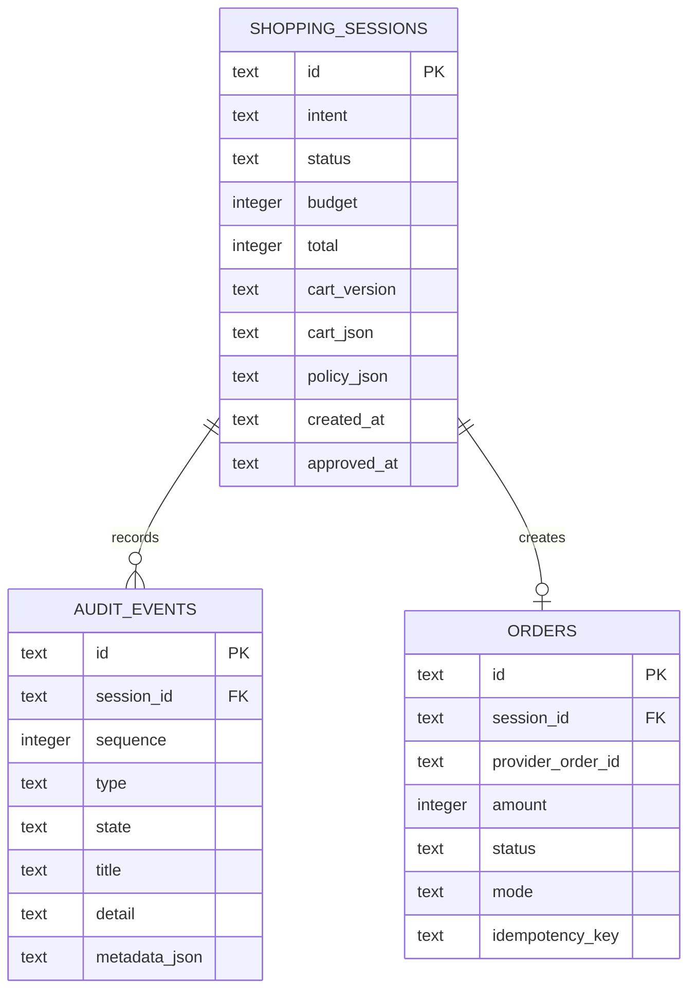
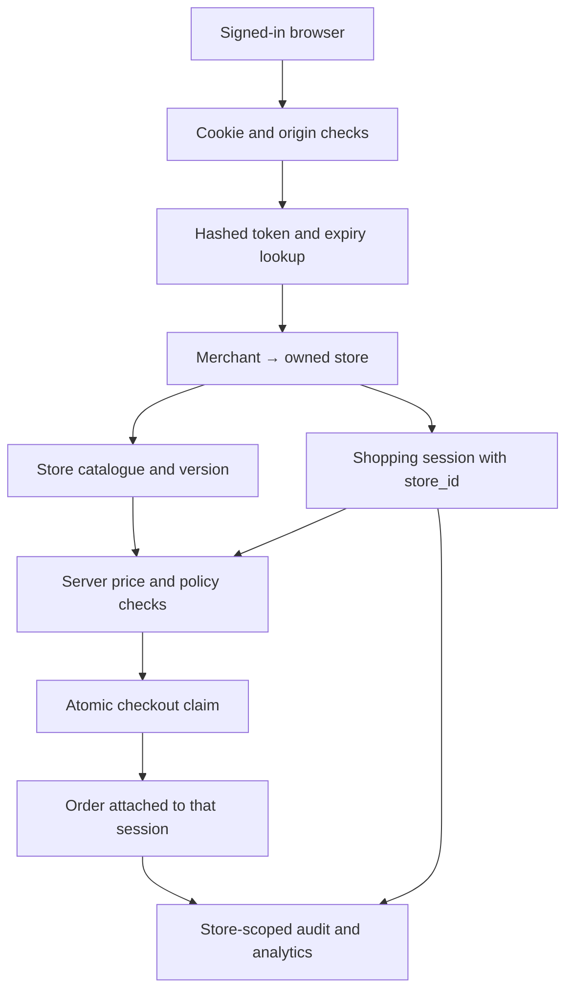
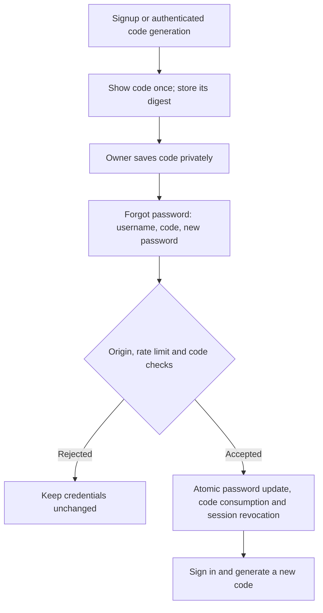

# IntentCart

IntentCart turns a shopping request into a cart that can explain itself.

Instead of opening ten product tabs, a buyer can write:

> Build a skincare gift for my sister under ₹2,000. She has sensitive skin, and I need it delivered by Friday.

IntentCart recommends a bundle from the merchant catalogue, explains each choice, checks the cart against the buyer's limits, and asks for approval of the exact cart version before creating a test order.

The important part is the boundary: the recommendation layer can suggest products, but it cannot authorize money. Catalogue validation, price calculation, inventory checks, cart versioning and approval all live in regular server code.

## Try it

| Surface | Purpose |
| --- | --- |
| [Product page](https://intent-cart.subhasree6289.chatgpt.site/) | The product story and core idea |
| [Buyer flow](https://intent-cart.subhasree6289.chatgpt.site/demo) | Build, edit, repair and approve a cart |
| [Merchant console](https://intent-cart.subhasree6289.chatgpt.site/merchant) | Revenue, conversion, policy state and recent sessions |
| [Audit trail](https://intent-cart.subhasree6289.chatgpt.site/audit) | The latest persisted decision trace |

Checkout runs in a test environment. The full order lifecycle is real application logic; no live payment is captured.

## What works today

- Natural-language shopping requests with schema validation.
- Model-backed recommendations when a Gemini or OpenAI key is configured.
- Merchant accounts with a private store, editable sample catalogue and store-scoped records.
- A deterministic recommendation path when the model is unavailable.
- Catalogue-only product selection and server-calculated totals.
- A cart that is populated from the recommendation API response.
- Quantity changes and gift-wrap upsells revalidated on the server.
- Durable shopping sessions, audit events and orders in Cloudflare D1.
- Versioned carts that invalidate approval after every change.
- An inventory-conflict path that blocks checkout before order creation.
- Server-side repair using an in-stock replacement followed by fresh approval.
- Idempotent test-order creation.
- Merchant and audit pages generated from recorded session data.
- Downloadable JSON traces.

## System architecture



The model sits outside the trusted boundary. Its product IDs are checked against the catalogue and its proposed total is ignored. The server looks up current prices and computes the amount itself.

## Checkout lifecycle



The checkout request deliberately does not contain an amount. It contains only the session ID, current cart version and explicit approval. The server loads the cart from D1 and calculates the amount from catalogue prices.

## Inventory failure and recovery

Open **Merchant → Orders** for pending, created and cancelled checkouts. **Check outcome & recover** waits at least one minute after approval, then checks the configured reconciliation adapter. It never submits another order. A confirmed existing order is saved; a terminal cancellation or non-creation confirmation restores stock once. Duplicate recovery requests and late checkout completions compete for the same database transition. Unconfirmed responses retain the reservation.

For external providers, configure `PAYMENT_RECONCILE_API_URL` with an HTTPS adapter you control. The server POSTs `{ idempotencyKey, orderId?, amount, currency }`, using the existing payment Basic credentials. The adapter must return `{ idempotencyKey, amount, currency: "INR", terminal: true, outcome: "created" | "cancelled" | "not_created", orderId? }`. Created outcomes require an order ID; an already observed order ID must match. **Only return terminal non-creation after guaranteeing that this idempotency key cannot create an order later.** A normal lookup 404 or eventual-consistency miss is not that guarantee and is rejected. This is an adapter contract, not a universal payment-provider API. With no adapter configured, external recovery remains locked. Local test-mode checkouts can be released without an external lookup because they have no external side effect.

Checkout reserves stock before contacting the order provider. The database updates the approval claim and the store’s available quantities in one transaction, guarded by the catalogue version. Two carts competing for the last unit cannot both reserve it. A stale catalogue-editor save is rejected rather than restoring stock from an old screen.

The catalogue editor’s **Available units** field excludes checkout reservations. Successful orders keep that deduction; repeated checkout requests do not deduct again. If the provider times out or the local order save fails, stock remains reserved while the order is locked for review. Reservations do not expire automatically: releasing stock without confirming the provider’s outcome could allow an item to be sold twice. Provider reconciliation and reservation release are available through Orders using the adapter contract above. Initiating provider cancellations or refunds remains separate work. Existing orders created before this update are not deducted retroactively.

Each reservation appears in the audit trail as **Stock reserved for checkout**. Tests cover competing carts, retry safety, stale editor saves, transaction rollback, and stock retention after uncertain outcomes.



The inventory-conflict control marks a product in the saved cart unavailable for that session. The exclusion is stored in the policy JSON and survives cart edits, repair attempts and server restarts. Repair looks for an available product in the same category that passes the request checks. If no replacement fits, the buyer must remove the item or change the request. This is a session-level failure exercise; merchant-wide stock synchronisation and authenticated inventory webhooks are still separate work.

### Concurrent checkout and uncertain outcomes

Cart updates compare the submitted version inside the database write. Only the winning update changes the cart and appends its audit events. Checkout similarly changes a ready session to approved in a database batch before contacting the order provider. That saved claim locks cart edits and other checkout requests. Audit sequence numbers are allocated inside the write batch.



`Review` is represented by an approved session with an unknown checkout attempt in its policy JSON. A timeout, invalid provider response or failed local order save leaves the claim locked. There is no automatic claim expiry: releasing it without reconciling the provider could duplicate an order. The audit trace retains the attempt ID and idempotency key, and the policy retains a provider order ID when one was observed. A process interruption can leave a pending claim, which also stays locked. An operator reconciliation workflow is not implemented yet; do not clear these records or submit a replacement order without checking the provider.

This prevents concurrent provider submissions for the same saved session. It does not deduplicate separate shopping sessions or guarantee a provider's own idempotency behavior. Provider tests use controlled responses, including timeout, mismatched amounts and a failed database save after provider success.

## Data model



`(session_id, sequence)`, `orders.session_id` and `orders.idempotency_key` are unique. Recent-session and status queries have dedicated indexes. Schema changes are generated with Drizzle and shipped as append-only migrations.

## Policy boundary

Every cart is checked for:

1. known catalogue product IDs;
2. integer quantities between 1 and 3;
3. current stock;
4. delivery within the promised window;
5. a total within the budget parsed from the request (₹2,000 when omitted); and
6. an exact cart version at checkout.

The policy result is stored with the session and recalculated before order creation. A `passed` value from the client or model is never trusted.

### Request constraints

The server now reads INR budgets, supported product categories and exclusions before requesting a recommendation. Both the model output and the catalogue fallback pass through the same checks. Those checks run again on cart edits and checkout; removing every item blocks checkout.

Try `Only sunscreen. No cleanser, serum or gift wrap. Budget ₹600.` The resulting cart should contain the ₹599 sunscreen. `Only sunscreen under ₹100` returns a no-match response instead of a preset bundle. Changing the request in the browser requires building a new cart before checkout.

This parser is intentionally limited to the five-product catalogue. It recognises cleanser, serum, sunscreen/SPF and gift wrap, plus sensitive-skin and fragrance-free catalogue tags. Explicitly named categories restrict the selection. Budgets support rupee symbols, INR/Rs, commas, decimals and `k`. Delivery supports today, tomorrow, numeric day limits and weekdays; weekday calculations use UTC and the session creation date, and remain catalogue estimates. Other delivery formats ask for clarification. Requested quantities ask the buyer to use the cart controls. This is not yet a general natural-language constraint engine: compound requests, unsupported items mixed with supported items, and arbitrary ingredient restrictions still need stronger extraction and confirmation.

If no suitable selection covers the explicitly requested categories within budget, `/api/agent` returns HTTP 422 with `NO_MATCH`; unsupported input returns `CLARIFICATION_REQUIRED`. These attempts do not yet create an audit session. Buyers can remove products after the initial selection. Merchant catalogue ingestion and persisted constraint schemas remain follow-up work.

Gemini is configured on the server using `GEMINI_API_KEY` and `GEMINI_MODEL`. The example model is `gemini-3.5-flash-lite`, which was verified with the development account; model access depends on your account. Provider errors or invalid selections use the constrained fallback. The UI shows the policy result instead of presenting the model's uncalibrated fit score as a measured percentage.

## API surface

### `POST /api/agent`

Creates and persists a shopping session.

```json
{
  "intent": "Build a skincare gift under ₹2,000 for sensitive skin."
}
```

The response contains a session ID, cart version, normalized products, server total, policy result, fit score and recommendation mode.

### `POST /api/cart`

Updates the current cart or runs an inventory transition.

```json
{
  "sessionId": "IC-41F7A2B9",
  "cartVersion": "IC-41F7A2B9-v1",
  "action": "update",
  "items": [
    { "productId": "sku_cleanser_01", "quantity": 2 }
  ]
}
```

Supported actions are `update`, `conflict` and `repair`. Every successful update returns a new authoritative version when the cart changes.

### `POST /api/checkout`

```json
{
  "sessionId": "IC-41F7A2B9",
  "cartVersion": "IC-41F7A2B9-vm1abc23",
  "approval": true
}
```

The server rejects missing approval, stale versions, blocked sessions, changed totals and failed policy checks. A repeated request for an already completed version returns the existing order.

### `GET /api/audit?sessionId=...`

Returns the session and its ordered event list. Without a session ID it returns the latest recorded trace.

### `GET /api/merchant`

Returns aggregate revenue, order value, conversion counts, blocked-session counts and recent sessions from D1.

## Running locally

You need Node.js 22.13 or newer and npm.

```bash
git clone https://github.com/6289subhasree/intent-cart.git
cd intent-cart
npm ci
cp .env.example .env.local
npm run dev
```

Open the local URL printed by Vite.

Open `/login`, choose **Create a store**, and enter a username, password and store name. Registration creates an owner account and a separate copy of the five sample products. Use **Catalogue** in the merchant sidebar to change your store’s product names, prices, stock and delivery estimates. Open the shopping workspace to try those values in a recommendation.

For an existing Windows checkout, stop Vite with Ctrl+C, run `git pull origin main`, then `npm run dev`. Startup now uses a Node script so PowerShell does not need Bash-style environment assignments. It applies the account migration before opening Vite. Your existing Gemini settings stay in `.env.local`.

Older shopping records had no store owner. The migration keeps them with a null `store_id`; they are excluded from signed-in workspaces rather than being assigned to the first person who registers. A new account therefore starts with an empty dashboard. No old records are deleted, and there is no public “claim old records” endpoint.

`npm run dev` applies unapplied D1 migrations to the local database before starting the app. No API credentials are required for the full persisted cart, policy, failure, repair and test-order flow.

Typical setup time:

- first run: roughly 2–5 minutes, mostly dependency installation;
- later runs: usually under a minute;
- full build and test suite: usually under a minute on a modern laptop.

### Optional recommendation model

```env
OPENAI_API_KEY=your_key_here
OPENAI_MODEL=gpt-5-mini
```

Without these values, IntentCart uses its deterministic recommendation path. Persistence, policy enforcement and checkout behavior are unchanged.

### Optional test payment provider

```env
PAYMENT_ORDER_API_URL=https://your-provider.example/orders
PAYMENT_KEY_ID=your_test_key
PAYMENT_KEY_SECRET=your_test_secret
PAYMENT_IDEMPOTENCY_HEADER=X-Idempotency-Key
```

The adapter sends HTTP Basic authentication, an amount in paise and the cart-derived idempotency key. Keep credentials in `.env.local`; that file is ignored by Git.

## Commands

| Command | Purpose |
| --- | --- |
| `npm run dev` | Apply local migrations and start the app |
| `npm run db:local` | Apply only the local D1 migrations |
| `npm run db:generate` | Generate a migration after a schema change |
| `npm run typecheck` | Generate Cloudflare types and check TypeScript |
| `npm run build` | Produce the Worker-compatible build |
| `npm test` | Build and run the full test suite |
| `npm run evaluate` | Recalculate the controlled evaluation fixture |

## Tests

The suite covers the complete session lifecycle, not only isolated helpers:

- recommendation creates a saved session with a server-priced cart;
- audit events can be read back in order;
- checkout requires explicit approval;
- checkout rejects an older cart version;
- over-budget quantity changes produce a blocked session;
- inventory failure prevents order creation;
- repair replaces the unavailable product and resets approval;
- a valid approval creates an order;
- a repeated checkout reuses that order;
- merchant totals reflect the stored order;
- catalogue price calculation and invalid-item handling; and
- production Worker rendering and shared UI semantics.

The API lifecycle tests apply all SQL migrations to an in-memory SQLite database with a D1 adapter. Authentication tests create two actual accounts and exercise separate catalogues, foreign session IDs, scoped analytics, cookie expiry, logout, password changes, recovery-code rotation and concurrent single-use resets, origin checks and login/reset throttling. Provider responses are controlled in tests. The local D1 migration is also checked separately; these checks are not a substitute for production security review.

## Merchant accounts and store ownership

Each account owns one store. The server resolves that store from an opaque session cookie, never from a store ID submitted by the browser. Every commerce API requires authentication. Session and audit lookups include the resolved store ID; order records and audit events belong to their parent shopping session. The “latest trace” and merchant totals are also scoped to the signed-in store.



Passwords use PBKDF2-HMAC-SHA256 with a random salt and 600,000 iterations. The database stores only a SHA-256 digest of each random 256-bit session token. Sessions expire after seven days; logout deletes the token record. Password changes revoke existing sessions and issue a fresh cookie. Cookies are HttpOnly and SameSite=Strict, with Secure enabled on HTTPS. State-changing APIs reject missing or mismatched origins and oversized request bodies. Sign-in and registration have database-backed rate limits. The password work factor follows the [OWASP password-storage guidance](https://cheatsheetseries.owasp.org/cheatsheets/Password_Storage_Cheat_Sheet.html); the implementation uses [Cloudflare’s supported Node crypto API](https://developers.cloudflare.com/workers/runtime-apis/nodejs/crypto/).

| Endpoint | Purpose |
| --- | --- |
| `POST /api/auth/register` | Create an owner and a store; sign in |
| `POST /api/auth/login` | Verify credentials and issue a session |
| `GET /api/auth/me` | Return the current owner’s store identity |
| `POST /api/auth/logout` | Revoke the current session |
| `POST /api/auth/password` | Change password and revoke other sessions |
| `POST /api/auth/recovery-code` | Generate a replacement recovery code after checking the current password |
| `POST /api/auth/reset` | Consume a recovery code, reset the password and revoke all sessions |
| `GET /api/catalogue` | Read the owner’s catalogue and version |
| `PUT /api/catalogue` | Update that catalogue using its current version |

Catalogue edits affect only the owner’s store. Recommendation and fallback logic receive that catalogue explicitly; they do not mutate a shared module-level list. Checkout recalculates against the current store catalogue and rejects a changed total. Its database claim also checks the catalogue version, closing the gap if a catalogue edit wins just before checkout.

This release is a private owner workspace, not yet a public storefront. Staff invitations, email-based recovery, MFA, account deletion, general product import and per-store payment-provider credentials are still missing. Save your password and recovery code. The catalogue editor manages the existing five product categories; renaming a product does not change its category. API model and test-order credentials remain server configuration. The hosted demo is updated separately from GitHub and may run an earlier release.

## Repository map

```text
app/
├── api/
│   ├── agent/route.ts       recommendation + session creation
│   ├── cart/route.ts        cart edits, conflicts and repair
│   ├── checkout/route.ts    approval, policy reload and order creation
│   ├── audit/route.ts       persisted trace reader
│   └── merchant/route.ts    aggregate session metrics
├── demo/page.tsx            buyer workspace
├── audit/page.tsx           trace viewer
├── merchant/page.tsx        merchant console
└── page.tsx                 product page
db/
├── schema.ts                Drizzle schema
└── repository.ts            prepared D1 queries
drizzle/                     append-only SQL migrations
lib/commerce.ts              catalogue, totals, policy and repair
tests/                       lifecycle, policy, rendering and UI tests
worker/index.ts              Cloudflare Worker entry point
```

## Evaluation fixture

`evaluation/summary.json` is a controlled 500-session benchmark that can be reproduced with `npm run evaluate`. It is kept separate from the merchant console: the console now displays recorded application sessions, while the fixture remains useful for repeatable regression comparisons.

## Technology

- React 19 and TypeScript
- Vinext and Vite
- Cloudflare Workers and D1
- Drizzle migrations with prepared D1 statements
- Zod request validation
- Tailwind CSS and Shadcn UI primitives
- Recharts
- OpenAI Responses API as an optional recommendation provider

## Next useful additions

- Merchant-managed catalogue ingestion instead of the bundled five-product catalogue.
- Webhook-driven inventory updates.
- Staff roles, email-based recovery, MFA and public shopper access with session ownership.
- Expiring approval tokens for long-running carts.
- Provider webhook reconciliation for order status.
- Observability around model latency, fallback rate and policy rejection reasons.

Those are deliberately separate from the current core: the repository already demonstrates the full recommendation → policy → persisted session → approval → test order → audit loop end to end.

## Recovering a merchant account

Signup shows a random recovery code once. Save it in a password manager alongside your username before opening the store. Existing accounts can generate a code from **Account → Password recovery** by entering their current password. Generating a new code invalidates the previous one.

On the sign-in page, choose **Forgot password?**, enter your username and saved code, and choose a new password. A successful reset consumes the code and signs out every existing session. Sign in again, then generate a replacement code for next time. Ordinary password changes leave your saved recovery code valid.

There is no email service or verified email address in the account model yet. Recovery therefore requires a code saved in advance; knowing a username is not sufficient. If you lose both your password and recovery code, this self-service flow cannot restore access.

The server stores a SHA-256 digest of the random 256-bit code, never its plaintext. Reset attempts are rate limited by username and IP. Updating the password, consuming the code and revoking sessions share one database transaction; concurrent uses of the same code allow only one successful reset. The code is returned only at signup or authenticated generation, in a response marked `no-store`, and is not placed in browser storage or URLs.



After updating an existing checkout, `npm run dev` applies the new recovery-column migration automatically. It preserves accounts and store records; existing accounts initially have no recovery code.
